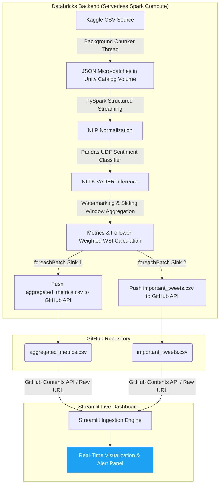

# Real-Time Twitter Financial Sentiment Seismograph

[](https://real-time-twitter-financial-sentiment-seismograph.streamlit.app/)

An end-to-end, cloud-native streaming analytics pipeline and real-time dashboard designed for quantitative traders and portfolio managers. The system emulates a high-frequency live social media stream, processes and normalizes data at scale using PySpark, performs parallel NLP sentiment scoring, computes rolling statistical panic indices, and serves active trading signals on a premium dark-mode dashboard.

This project was developed for DAMO630 - Advanced Data Analytics in the Master of Data Analytics program, University of Niagara Falls Canada.

------------------------------------------------------------------------

## System Architecture

The pipeline is split into a scalable data processing backend (Databricks) and a responsive frontend dashboard (Streamlit) synced via the GitHub Contents API.



------------------------------------------------------------------------

## Course Modules Integrated

-   **Mining Data Streams (Week 3-4):** Implements a PySpark Structured Streaming read stream monitoring an active ingestion zone. A background thread emulator splits the Twitter financial news dataset into micro-batches to mimic a live, high-frequency JSON feed.
-   **Natural Language Processing (NLP) (Week 5):** Uses Spark SQL regular expression functions to scrub URLs, user handles, and special symbols in parallel prior to analysis.
-   **Sentiment Analysis (Week 6):** Deploys NLTK's VADER (Valence Aware Dictionary and sEntiment Reasoner) inside a Spark Pandas UDF (User Defined Function) for vectorized sentiment classification on worker nodes.
-   **Statistical Signal Analytics (Advanced Application):** Computes a log-weighted Weighted Sentiment Index (WSI) based on follower counts. A rolling Z-score tracks negative sentiment variance over a sliding 10-window range to trigger automated BUY, SELL, or HOLD signals when negativity crosses a +2.5 standard deviation threshold.

------------------------------------------------------------------------

## Setup and Deployment Instructions

### Part 1: Running the Databricks Pipeline

The backend runs on Databricks inside a serverless Spark environment.

#### 1. Import the Project Workspace

Rather than copying and pasting cells manually, clone the repository directly into your Databricks workspace using Git Folders or cloning the repository: 1. Log in to your Databricks Workspace. 2. On the left sidebar, navigate to Workspace. 3. Right-click on your user folder (or choose a shared workspace location), select Create, and click Git Folder (or Repo). 4. Enter the Git Repository URL: `text    https://github.com/Lerneir/Real-Time-Twitter-Financial-Sentiment-Seismograph.git` 5. Select the target branch: `text    code-refactor` 6. Click Create. Databricks will clone the workspace, including the notebook located at `notebooks/databricks_notebook.py`.

#### 2. Automatic Unity Catalog Infrastructure Setup

The notebook is self-initializing. Upon execution of the setup cells, the notebook executes SQL queries to automatically verify and create the required catalog, schema, and managed volume structures: \* **Catalog**: `twitter_streaming` (via `CREATE CATALOG IF NOT EXISTS twitter_streaming`) \* **Schema**: `default` (via `CREATE SCHEMA IF NOT EXISTS twitter_streaming.default`) \* **Volume**: `checkpoints` (via `CREATE VOLUME IF NOT EXISTS twitter_streaming.default.checkpoints`)

These managed structures map to the volume paths: \* Incoming directory: `/Volumes/twitter_streaming/default/checkpoints/incoming` \* Metrics checkpoint directory: `/Volumes/twitter_streaming/default/checkpoints/tweets` \* Tweets checkpoint directory: `/Volumes/twitter_streaming/default/checkpoints/tweets_raw` \* Local metrics cache: `/Volumes/twitter_streaming/default/checkpoints/aggregated_metrics.csv` \* Local tweets cache: `/Volumes/twitter_streaming/default/checkpoints/important_tweets.csv`

Writing to Unity Catalog Volumes is mandatory when running on Databricks Serverless Compute to comply with compute environment storage restrictions.

#### 3. Upload the Kaggle Dataset

1.  Download the `twitter-financial-news` dataset from Kaggle (containing `train_data.csv`).

2.  Open Catalog Explorer in Databricks, navigate to `twitter_streaming` -\> `default` -\> `checkpoints`.

3.  Upload `train_data.csv` to this volume directory.

4.  In your notebook, ensure the `csv_source_path` widget is set to:

    ``` text
    /Volumes/twitter_streaming/default/checkpoints/train_data.csv
    ```

#### 4. Configure Notebook Widgets and Execute

At the top of the notebook, configure the connection widgets: \* `github_token`: Your GitHub Personal Access Token (requires `repo` write scopes). \* `github_repo`: Your repository path in the format `owner/repo` (e.g. `your-username/Real-Time-Twitter-Financial-Sentiment-Seismograph`). \* `github_branch`: The branch to push files to (use `code-refactor` to align with the active workspace). \* `github_file_path`: Path for metrics (`aggregated_metrics.csv`). \* `github_tweets_file_path`: Path for tweets (`important_tweets.csv`).

Click Run All. The notebook will start the streaming emulation thread and the PySpark Structured Streaming engines, periodically writing metrics and top tweets directly to your GitHub repository.

------------------------------------------------------------------------

### Part 2: Accessing the Live Dashboard

You can access the pre-deployed dashboard or run it locally.

#### Deployed Dashboard

The dashboard is hosted on Streamlit Community Cloud: <https://real-time-twitter-financial-sentiment-seismograph.streamlit.app/>

#### Running Locally

1.  Clone this repository to your machine.

2.  Install the required dependencies:

    ``` bash
    pip install -r requirements.txt
    ```

3.  Run the dashboard:

    ``` bash
    streamlit run app.py
    ```

    The dashboard will open at `http://localhost:8501`.

------------------------------------------------------------------------

### Part 3: Linking the Dashboard to your Stream

To display data from your running Databricks pipeline on the Streamlit dashboard: 1. Open the sidebar Control Hub on the dashboard. 2. Set the Active Data Stream Source to "Live Databricks Pipeline (via GitHub)". 3. Input your Repository Path (e.g. `your-username/Real-Time-Twitter-Financial-Sentiment-Seismograph`) and Target Branch (e.g. `code-refactor`). 4. **Bypass CDN Caching (Highly Recommended)**: Input your GitHub Personal Access Token in the token field. \* **Why this is needed**: GitHub's raw file servers (`raw.githubusercontent.com`) apply a strict 5-minute CDN cache lag. \* **How it works**: Providing a token causes the dashboard to query the GitHub Contents API (`api.github.com`) using base64 decoding, bypassing all CDN caching to retrieve live updates instantly (0-second lag). It also elevates your GitHub API rate limit from 60 to 5,000 requests per hour, ensuring smooth auto-refresh cycles.